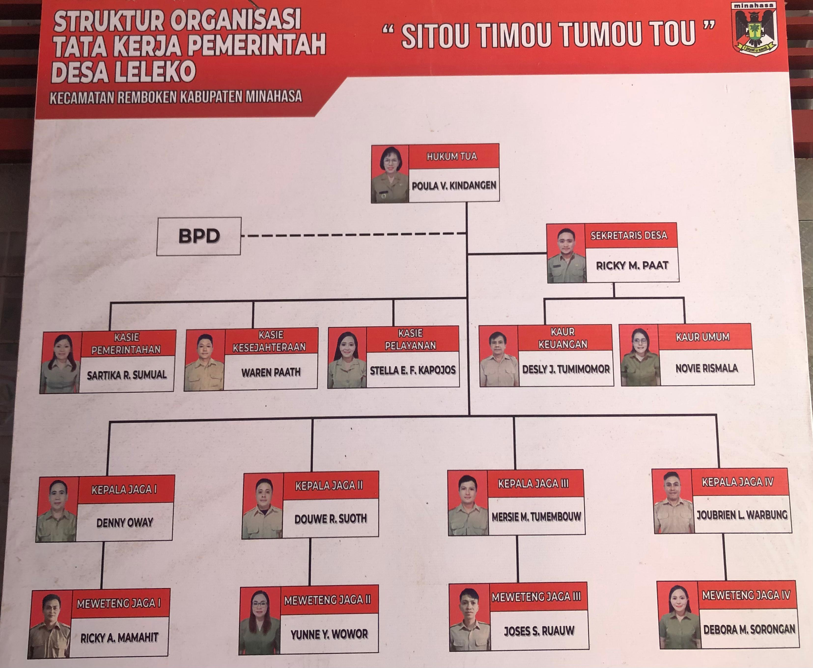
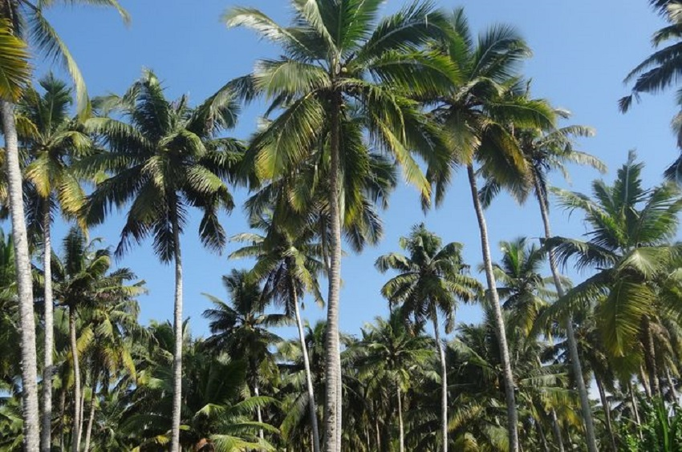
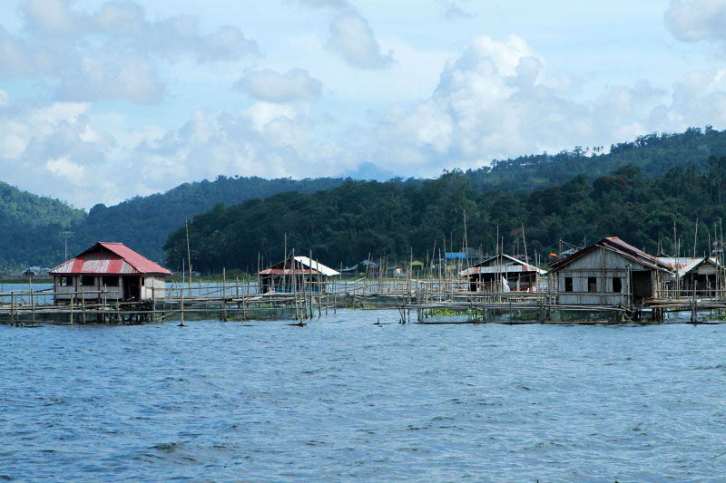
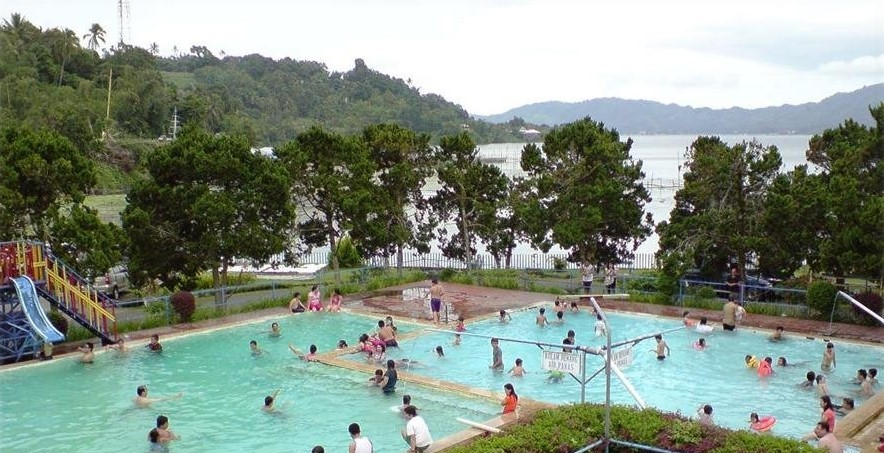
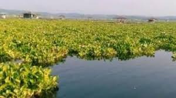
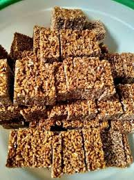

[Uploading Website Informasi Desa Leleko.html…]()<!DOCTYPE html>
<html lang="en">

<head>
   <meta charset="UTF-8">
   <meta name="viewport" content="width=device-width, initial-scale=1.0">
   <link rel="stylesheet" href="style.css">
   <title>Website Informasi Desa Leleko</title>

   
</head>

<body>

 
   

      

         <ul>
            <li><a href="#B">BERANDA</a></li>
            <li><a href="#TD">TENTANG DESA</a></li>
            <li><a href="#PD">POTENSI DESA</a></li>
            <li><a href="#TW">TEMPAT WISATA</a></li>
            <li><a href="#UL">USAHA LOKAL</a></li>
            <li><a href="#K">KONTAK</a></li>
         </ul>
      

      <!--BERANDA-->
      

         <h1>WEBSITE SISTEM INFORMASI DESA LELEKO</h1>
         
Desa Leleko, Kecamatan Romboken, Kabupaten Minahasa, Sulawesi Utara

         

            <button type="button">Visit now</button>
            <button type="button">Read now</button>
         

      

   

   

      
         <!--TENTANG DESA-->
         

            

            
TENTANG DESA

            <h2 class="des1">SEJARAH DESA LELEKO</h2>
            
Sejarah dari desa Leleko dapat dilihat pada gambar

            

            <h2>STRUKTUR DESA</h2>
            
            

         

            <!--POTENSI DESA-->
            

               

               
POTENSI DESA

               <h2>POTENSI DESA LELEKO</h2>
               
POTENSI PERTANIAN

               
Lahan Pertanian di Desa Leleko didominasi komoditas pertanian cabai.Sedangkan untuk komoditas
                  pertanian lain terdapat jagung, kacang tanah, padi, dan tanaman
                  multikultural lainnya. Lebih dari 50% penduduk desa Leleko bekerja di sektor pertanian.Desa Leleko
                  memiliki lahan pertanian dengan luas +- 100 Ha. Gambar dibawah ini contoh potensi pertanian jagung yang ada di Desa Leleko

               
               
POTENSI PERKEBUNAN

               
Kelapa menjadi salah satu komoditas di desa Leleko karena kelapa menjadi salah satu mata pencaharian
                  bagi masyarakat setempat.

               
               
POTENSI PERIKANAN

               
Desa Leleko memiliki garis pinggiran danau yang cukup panjang sehinnga dapat menjadi potensi daerah
                  tangkapan ikan bagi para nelayan. Komoditas perikanan di desa leleko adalah ikan mujair, ikan mas,
                  ikan wiwir-nike, dan ikan payangka.

               
               

            

            <!--TEMPAT WISATA-->
            

               

               
TEMPAT WISATA

               <h2>TEMPAT WISATA DI DESA LELEKO</h2>
               
Objek wisata Sumaru Endo adalah objek wisata sekaligus tempat rekreasi keluarga yang lokasinya berada
                  di tepian danau Tondano, tepatnya di Desa Leleko, Kecamatan Romboken, Minahasa, sekitar 12 km dari
                  Tondano, 45 km dari kota Manado, 65 km dari Bandara Internasional Sam Ratulangi Manado, Sulawesi
                  Utara. Pintu masuk ke lokasi wisata Sumaru Endo yang berada di ketinggian sekitar 1.000 meter di atas
                  permukaan laut. Nama Sumaru Endo sendiri diambil dari bahasa asli Romboken yang memiliki arti
                  "menghadap matahari terbit". Objek wisata Sumaru Endo yang dikelola
                  pemerintah Provinsi Sulawesi Utara yang
                  letaknya berada di Desa Leleko dengan panorama keindahan Danau Tondano, terdapat juga kolam renang
                  serta penginapan yang disediakan. Sumaru Endo memiliki potensi besar untuk menjadi tempat wisata menarik di tepian Danau Tondano, dengan kolam air panasnya serta wisata airnya

               
               
Tempat pemandian air panas alam Sumaru Endo yang masih dicari dan disenangi oleh masyarakat sekitar

               
               

            

            <!--USAHA LOKAL-->
            

               

               
USAHA LOKAL

               <h2>USAHA LOKAL DESA LELEKO</h2>
               
USAHA LOKAL YANG ADA DI DESA LELEKO :

               
Usaha percetakan Fullbreak/Hollobreak

               
               
Usaha pembuatan pakan/pelet ikan dari eceng gondok

               
               
Usaha Kue Bepang

               
               
Pengrajin Kayu

               
               

            

            <!--KONTAK-->
            

               

                  

                     

                        <h3>Alamat</h3>
                        
Desa Leleko terletak di wilayah kecamatan Romboken, Kabupaten Minahasa, Sulawesi Utara, Indonesia

                     

                     

                        <h3>Kode Pos</h3>
                        
95681

                     

                     

                        <h3>Email</h3>
                        
lelekodesa@gmail.com

                     

                     

                        <h3>HP</h3>
                        
082193282929

                     

                  

               

            

            

               

                  &copy; 2024.<b>Desa Leleko.</b>All Rights Reserved
               

            

   

</body>

</html>ko.html…]()

[Uploading style*{.css…]()
    padding: 0;
    margin: 0;
    font-family: sans-serif;
}

.micresoft{
   background-color: rgba(4, 90, 90, 0.174);
    color: #141313;

}

.microsoft1{
    padding-top: 5%;
   padding-left: 5%;
   width: 900px;
}

.microsoft2{
   padding-top: 5%;
   padding-left: 5%;
   padding-bottom: 3%;
}

.des2{
    width: 1150px;
    word-spacing: 5%;
    word-break: 10%;
}
.des1{
  color: #141414;
}

.banner {
    width: 100%;
    height: 100vh;
    background-image: linear-gradient(rgb(0, 0, 0,0.75),rgba(119, 115, 115, 0.5)),url(Gunung\ Slamet\ dan\ sawah.jpeg);
    background-size: cover;
    background-position: center;
    position: sticky;
    position: -webkit-sticky;
    top: 0;
    z-index: 1;
}
.navbar {
    width: 75%;
    margin: auto;
    padding: 35px 0;
    display: flex;
    align-items: center;
    justify-content: space-between;
    position: sticky;
    position: -webkit-sticky;
    top: 0;
    background: #0d3247;
    z-index: 1;
    border: 1px solid #364f6b;
}
.logo {
    width: 120px;
    font-size: 20px;
    color: #fff;
    font-weight: bold;
}
.navbar ul li {
    list-style: none;
    display: inline-block;
    margin: 0 20px;
    position: relative;
}
.navbar ul li a {
    text-decoration: none;
    color: #fff;
    text-transform: uppercase;
    font-weight: bold;
}
.navbar ul li::after{
    content: '';
    height: 3px;
    width: 0;
    background: #009688;
    position: absolute;
    left: 0;
    bottom: -10px;
    transition: 0.5s;
}
.navbar ul li:hover:after {
    width: 100%;
}
.content {
    width: 100%;
    position: absolute;
    top: 50%;
    transform: translateY(-50%);
    color: #fff;
    text-align: center;
}
.content h1 {
    font-size: 30px;
    margin-top: 80px;
}
.content p {
    margin: 10px auto;
    font-weight: 70;
    line-height: 5px;
}
button {
    width: 200px;
    padding: 15px 0;
    text-align: center;
    margin: 20px;
    border-radius: 25px;
    font-weight: bold;
    border: 2px solid #009688;
    background: transparent;
    color: #fff;
    cursor: pointer;
    position: relative;
    overflow: hidden;
}
span {
    background: #009688;
    height: 100%;
    width: 0;
    border-radius: 25px;
    position: absolute;
    left: 0;
    bottom: 0;
    z-index: -1;
    transition: 0.5s;
}
button:hover span {
    width: 100%;
}
button:hover {
    border: none;
}

section {
    margin-bottom: auto;
    display: flex;
    margin-bottom: 50px;
    background-color: rgb(235, 241, 236);
    background-size: 70%;
    margin-bottom: 20px;
    background-position: center;
    background-position: top;
}

.kolom {
    margin-top: 0px;
    margin-bottom: 50px;
 
}
.kolom .deskripsi {
    font-size: 25px;
    font-weight: bold;
    font-family: 'Franklin Gothic Medium', 'Arial Narrow', Arial, sans-serif;
    color: rgba(0, 0, 0, 0.929);

}
h2 {
    font-family: Cambria, Cochin, Georgia, Times, 'Times New Roman', serif;
    font-weight: 800;
    font-size: 20px;
    margin-bottom: 5px;
    color: black;
    width: 100%;
    line-height: 50px;
}
img {
    width: 60%;
    height: 50vh;
    background-size: 70%;
    margin-bottom: 20px;
}
P {
    font-size: 17px;
    font-weight: 100;
    margin-bottom: 5px;
}

#k {
    background: #dedede;
    padding: 50px 0px 50px 0px;
}

.footer {
    width: 100%;
    position: relative;
    display: flex;
    flex-wrap: wrap;
    margin: auto;
}

.footer-microsoft {
    width: 20%;
    margin: 0 auto;
}

h3 {
    font-family: 'comic sans ms';
    font-weight: 800;
    font-size: 30px;
    margin-bottom: 20px;
    color: rgba(3, 0, 0, 0.788);
    width: 100%;
    line-height: 50px;
}

#copyright {
    text-align: center;
    width: 100%;
    padding: 50px 0px 50px 0px;
}
